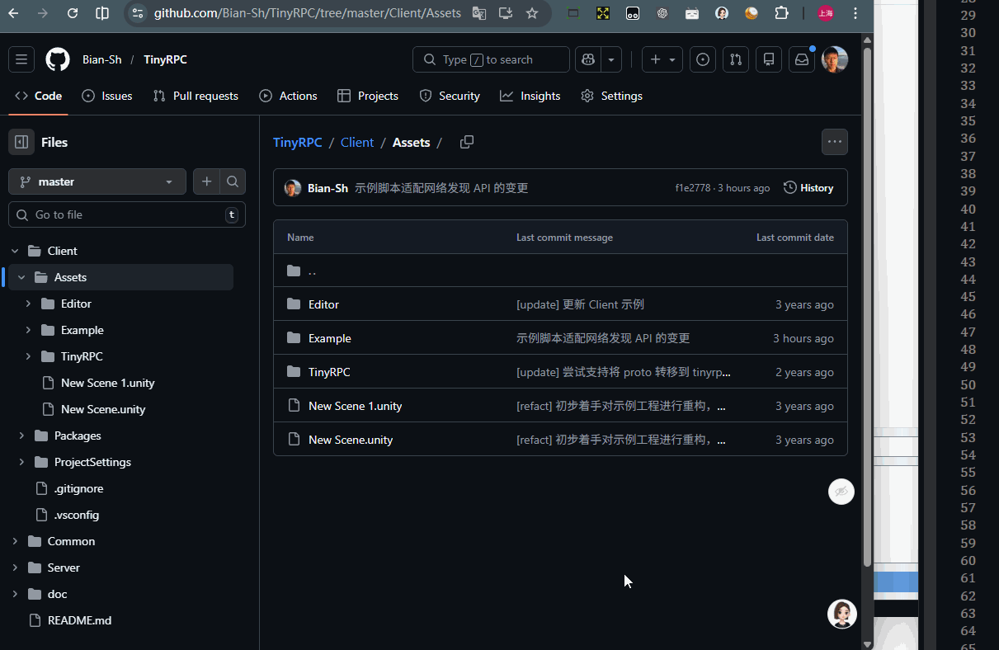

🇺🇸 Hide `.meta` files in Unity engine project hosted on GitHub.

🇯🇵 GitHub のリポジトリ画面で `.meta` ファイルを非表示にします。

# Install (Developer Mode)

1. Clone or download this repository
2. Open `chrome://extensions` (or `edge://extensions`)
3. Enable Developer mode
4. Load unpacked → select this folder
